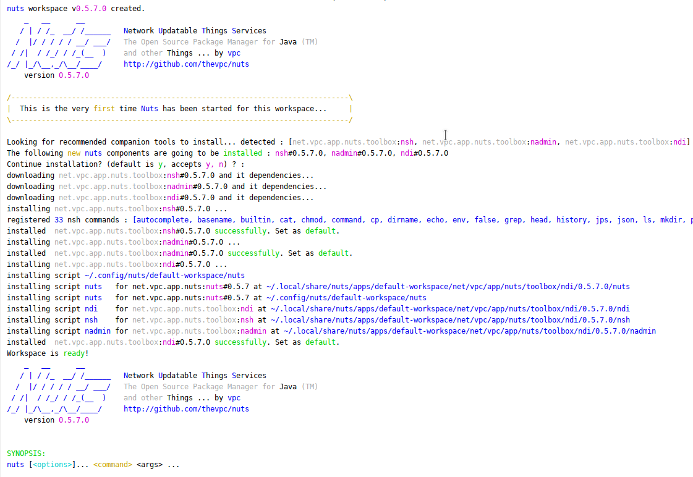

# nuts
Network Updatable Things Services
<pre>
    _   __      __
   / | / /_  __/ /______
  /  |/ / / / / __/ ___/
 / /|  / /_/ / /_(__  )
/_/ |_/\__,_/\__/____/   version 0.5.7.0
</pre>

nuts stands for **Network Updatable Things Services** tool. It is a simple tool  for managing remote
artifacts, installing these  artifacts to the current machine and executing such  artifacts on need.
Each managed package  is also called a **nuts** which  is a **Network Updatable Thing Service** .
Nuts artifacts are  stored  into repositories. A  **repository**  may be local for  storing local Nuts
or remote for accessing  remote artifacts (good examples  are  remote maven  repositories). It may
also be a proxy repository so that remote artifacts are fetched and cached locally to save network
resources.
One manages a set of repositories called a  workspace. Managed **nuts**  (artifacts)  have descriptors
that depicts dependencies between them. This dependency is seamlessly handled by  **nuts**  (tool) to
resolve and download on-need dependencies over the wire.

**nuts** is a swiss army knife tool as it acts like (and supports) **maven** build tool to have an abstract
view of the the  artifacts dependency and like  **npm**, **pip** or **zypper/apt-get**  package manager tools  
to  install and uninstall artifacts allowing multiple versions of the very same artifact to  be installed.

## COMMON VERBS:
+ deploy,undeploy   : manage artifacts (package installers) on the local repositories
+ install,uninstall : install/uninstall a package (using its fetched/deployed installer)
+ update            : update a package (using its fetched/deployed installer)
+ fetch,push        : download from, upload to remote repositories
+ find              : searche for existing/installable artifacts

## Download Latest stable version
+ Linux,Windows,iOS, and Java enabled OS : [nuts-0.5.7.jar](https://github.com/thevpc/vpc-public-maven/raw/master/net/vpc/app/nuts/nuts/0.5.7/nuts-0.5.7.jar)
+ On Unix/Linux platforms you may use :
    + using **wget**
        ```
        wget https://github.com/thevpc/vpc-public-maven/raw/master/net/vpc/app/nuts/nuts/0.5.7/nuts-0.5.7.jar
        ```
    + or using **curl**
        ```
        curl https://github.com/thevpc/vpc-public-maven/raw/master/net/vpc/app/nuts/nuts/0.5.7/nuts-0.5.7.jar > nuts-0.5.7.jar 
        ```

## Requirements
Java Runtime Environment (JRE) or Java Development Kit (JDK) version 8 or later

## Installation
Nuts needs no installation. It will create all needed configuration upon the very first launch.
When you type the following line, welcome command will be executed and hence, any pos-install configuration will be triggered:
```
java -jar nuts-0.5.7.jar
```
Yous should then see some log like the following :



On Unix-like systems, first launch will configure "~/.bashrc" so that **nuts** command will be available in any future terminal instance.
On Windows systems, first launch will create a shortcut on Desktop to launch a configured command terminal.

To test installation the simplest way is to type : 

```
java -jar nuts-0.5.7.jar --version
```

On linux (as Ndi is supported), companion scripts are installed to make it even simpler to use nuts.

```
nuts --version
```

It should show a result in the format : nuts-api-version/nuts-impl-version

```
0.5.7/0.5.7.0
```

To run a command just type

```
nuts <command>
```


# Troubleshooting
Whenever installation or running fails, it is more likely that there is a misconfiguration or invalid libraries that are used. 
See [troubleshooting documentation](docs/troubleshooting.md) for more details


## Releases
View All releases [here](https://github.com/thevpc/nuts/releases) : 
+ 2019/07/23 	nuts 0.5.7.0 released [download nuts-0.5.7.jar](https://github.com/thevpc/vpc-public-maven/raw/master/net/vpc/app/nuts/nuts/0.5.7/nuts-0.5.7.jar) ([view change log](https://github.com/thevpc/nuts/blob/master/docs/change-log/v0.5.7.0.md))
+ 2019/06/23 	nuts 0.5.6.0 released [download nuts-0.5.6.jar](https://github.com/thevpc/vpc-public-maven/raw/master/net/vpc/app/nuts/nuts/0.5.6/nuts-0.5.6.jar) ([view change log](https://github.com/thevpc/nuts/blob/master/docs/change-log/v0.5.6.0.md))
+ 2019/06/08 	nuts 0.5.5.0 released [download nuts-0.5.5.jar](https://github.com/thevpc/vpc-public-maven/raw/master/net/vpc/app/nuts/nuts/0.5.5/nuts-0.5.5.jar) ([view change log](https://github.com/thevpc/nuts/blob/master/docs/change-log/v0.5.5.0.md))
+ 2019/04/21 	nuts 0.5.4.0 released [download nuts-0.5.4.jar](https://github.com/thevpc/vpc-public-maven/raw/master/net/vpc/app/nuts/nuts/0.5.4/nuts-0.5.4.jar) ([view change log](https://github.com/thevpc/nuts/blob/master/docs/change-log/v0.5.4.0.md))
+ 2019/01/05 	nuts 0.5.3.0 released [download nuts-0.5.3.jar](https://github.com/thevpc/vpc-public-maven/raw/master/net/vpc/app/nuts/nuts/0.5.3/nuts-0.5.3.jar) ([view change log](https://github.com/thevpc/nuts/blob/master/docs/change-log/v0.5.3.0.md))
+ 2018/12/28 	nuts 0.5.2.0 released [download nuts-0.5.2.jar](https://github.com/thevpc/vpc-public-maven/raw/master/net/vpc/app/nuts/nuts/0.5.2/nuts-0.5.2.jar) ([view change log](https://github.com/thevpc/nuts/blob/master/docs/change-log/v0.5.2.0.md))
+ 2018/12/18 	nuts 0.5.1.0 released [download nuts-0.5.1.jar](https://github.com/thevpc/vpc-public-maven/raw/master/net/vpc/app/nuts/nuts/0.5.1/nuts-0.5.1.jar) ([view change log](https://github.com/thevpc/nuts/blob/master/docs/change-log/v0.5.1.0.md))
+ 2018/11/25 	nuts 0.5.0.0 released [download nuts-0.5.0.jar](https://github.com/thevpc/vpc-public-maven/raw/master/net/vpc/app/nuts/nuts/0.5.0/nuts-0.5.0.jar) ([view change log](https://github.com/thevpc/nuts/blob/master/docs/change-log/v0.5.0.0.md))

## Getting started

 You may consider browsing the Nuts official [wiki](https://github.com/thevpc/nuts/wiki) .
